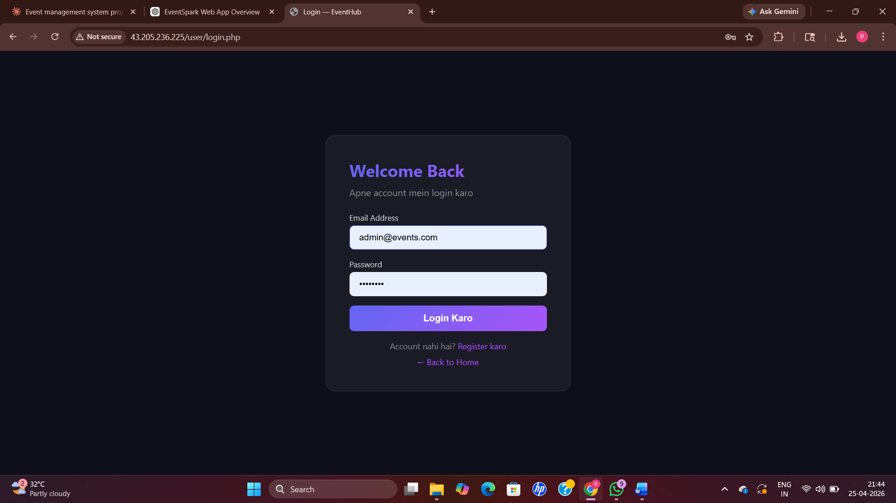
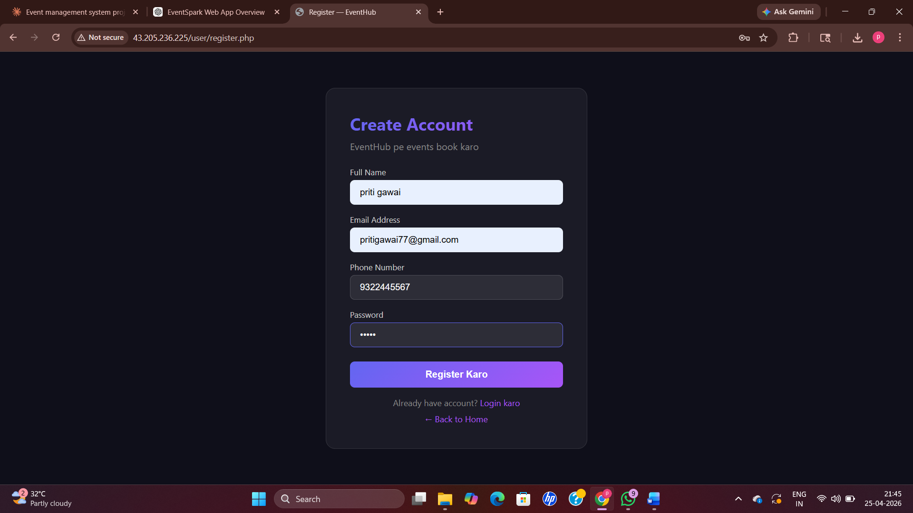
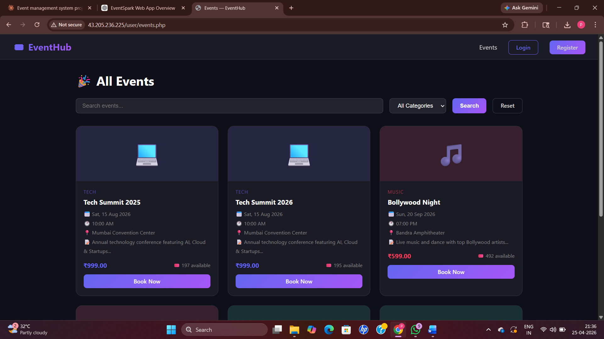
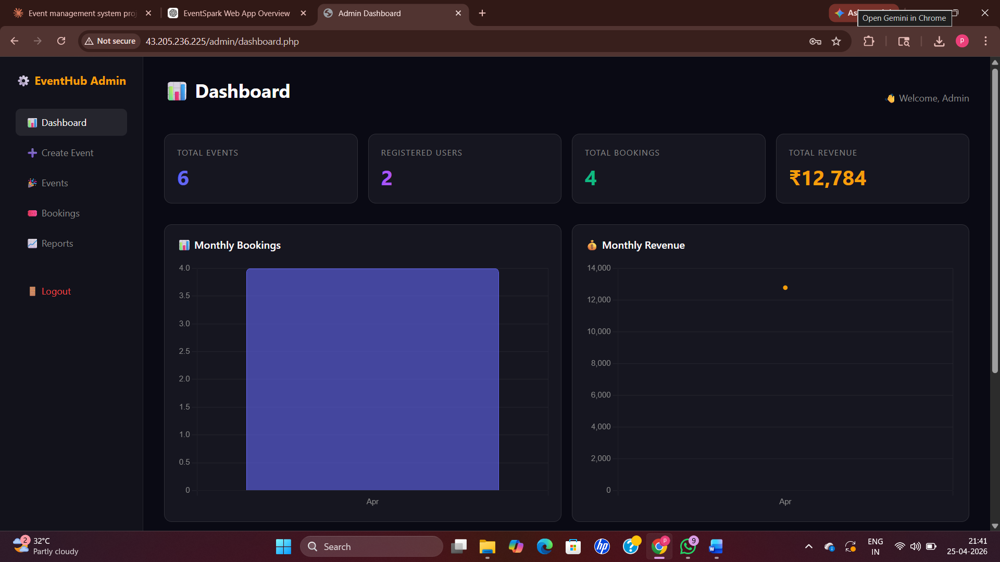
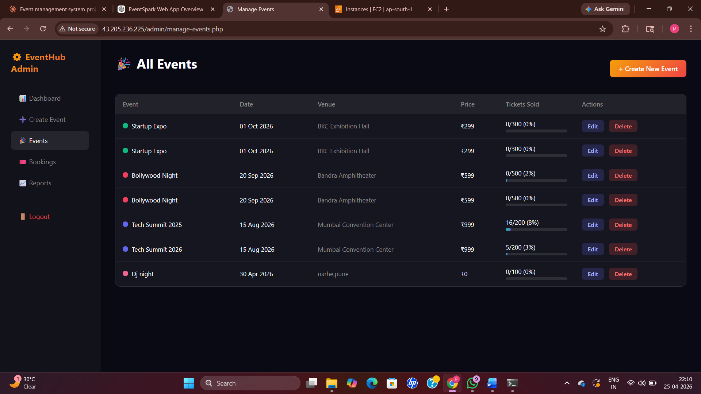
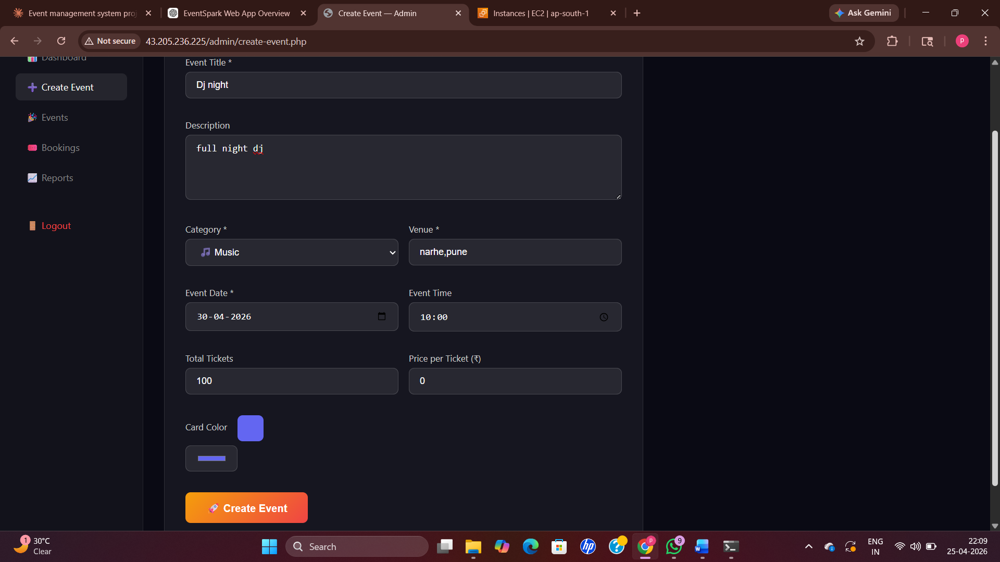
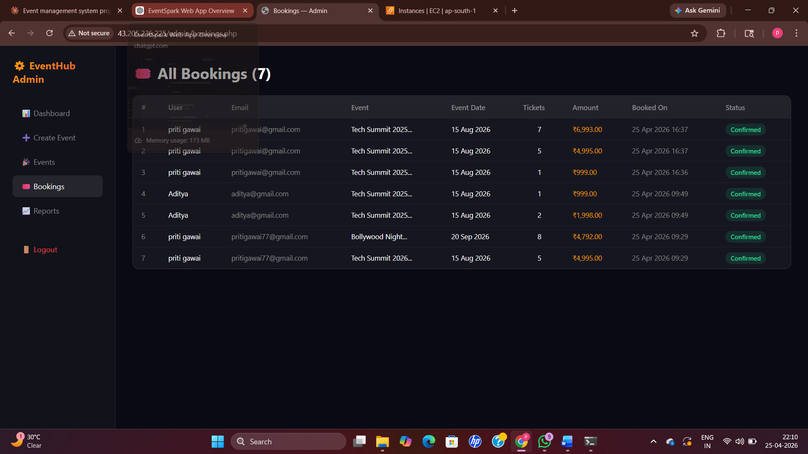

# 🎉 EventHub — Event Booking Web Application

🚀 A full-stack web application that allows users to browse events and book tickets online.

---

## 🔥 Features

✨ Browse all upcoming events in one place  
🔍 Search & filter events بسهولة  
🎟️ Book tickets directly from event page  
🔐 Secure user authentication (Login/Register)  
📱 Fully responsive (mobile-friendly)

---

## 🛠️ Tech Stack

| Layer       | Technology |
|------------|-----------|
| Frontend   | HTML, CSS, JavaScript |
| Backend    | PHP |
| Database   | MySQL |
| Server     | Apache (AWS EC2) |

---

## 📂 Project Structure
/admin        → Admin dashboard
/user         → User panel
/config       → Database configuration
/includes     → Common files
index.php     → Homepage

---

## ☁️ Deployment

✅ Deployed on AWS EC2 using LAMP Stack  
✅ GitHub used for version control  

---

## 🌐 Live Demo

🔗 http://43.205.236.225

---

# 🎉 EventHub — Event Booking Web Application

EventHub is a PHP-based web application that allows users to browse events and book tickets easily.

---

## 🌐 Live Demo
🔗 http://43.205.236.225

---

## 📸 Screenshots

### User Login

### User Registration

### Ticket Booking

### All Events

### Admin Login

### Admin Dashboard

### Created Events

### Event Creation

### All Bookings

---

## ✨ Features

- 📌 Events Listing — View all upcoming events
- 🔍 Filter & Search — Easily find events
- 🎟️ Ticket Booking — Book tickets directly
- 🔐 User Authentication — Register & Login system
- 📱 Mobile Friendly — Works on all devices

---

## 🛠️ Tech Stack

- Frontend: HTML, CSS, JavaScript
- Backend: PHP
- Database: MySQL
- Server: Apache (AWS EC2)

---

## 📁 Project Structure

- `index.php` — Homepage  
- `user/events.php` — Events listing  
- `admin/` — Admin panel  
- `config/db.php` — Database connection  
- `includes/auth.php` — Authentication logic  

---

## 👩‍💻 Author

**Priti Gawai**  
🎓 Computer Engineering Student  
💡 Interested in Web Development & Machine Learning  

---

## ⭐ Show your support

If you like this project, give it a ⭐ on GitHub!
